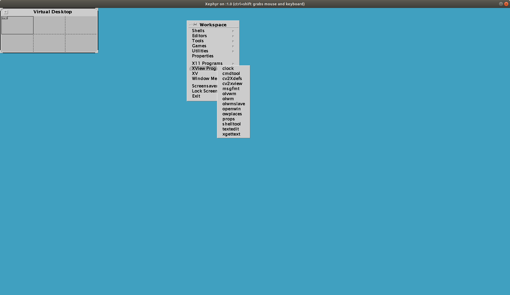
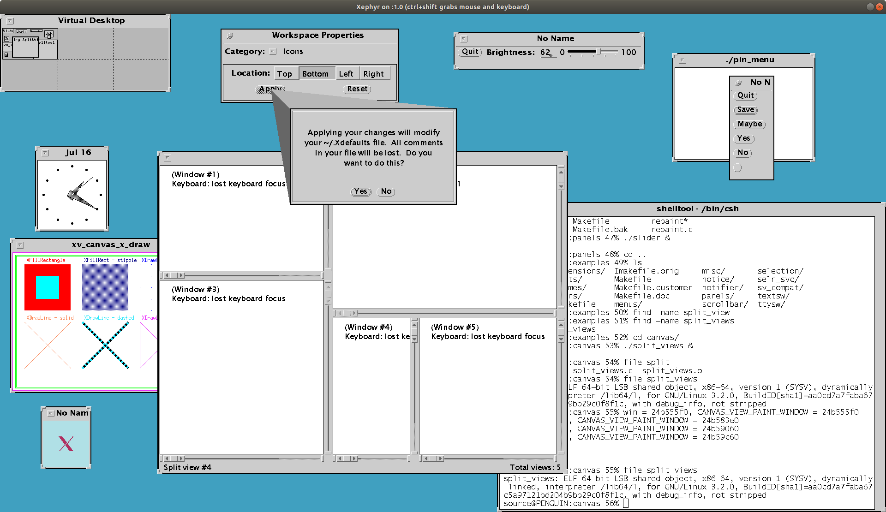

# Introduction

This is a working version of 64bit XView. It is based on [xview-3.2p1.4-25.16.zip](https://sourceforge.net/projects/xview/files/xview/) . I have built and tested it on **Ubuntu 18.04**.

# Requirments
In addition to the requirements normally needed for building **XView**, the followings are necessary:

1. a C compiler supporting variadic macros, i.e. a C99 compliant compiler, and
2. [Boost.Preprocessor](https://www.boost.org/doc/libs/1_75_0/libs/preprocessor/doc/index.html) .


# Building process on Ubuntu 18.04
After cloning the repository on your local machine, you can change to the directory and run the following command to build XView.

```bash
$sudo bash ./Build-LinuxXView.bash.amd64 all
```

This command will build and install the libraries, clients, olvwm, and contrib.

During the process of building, if there are errors about missing header files, you can install the corresponding packages which contain those header files, then run the above command again to proceed. 

# Testing
You can test the application in clients and contrib directories on your native Window Manager, or run olvwm and then test the applications in olvwm.

To test the applications in olvwm, you can run the command

```bash
$Xephyr -screen 1920x1080 :1 &
```

to start a nested X server and create a screen, then run the command

```bash
$/usr/openwin/bin/olvwm -f -display :1.0 &
```
to start olvw on that screen. You can click the right button of mouse to bring up the context menu and select 'shell tool' to run, as shown by 



Then you can start the applications from the shell tool, as shown by



# License
The orginal files in [xview-3.2p1.4-25.16.zip](https://sourceforge.net/projects/xview/files/xview/) are copyrighted by the authors or patch providers, as described in copyright, legal notice or COPYING files in each program's top-level directory and/or in the source files themselves.

All additional patches or contributions made on top of the orginal files  in [xview-3.2p1.4-25.16.zip](https://sourceforge.net/projects/xview/files/xview/),  are licensed under GPLv3.
